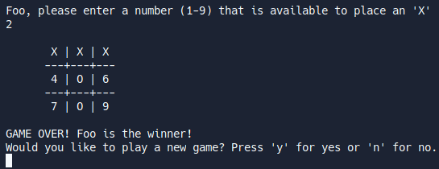

# Tic Tac Toe

This was the first major project in The Odin Project's Ruby course.

The goal was to build a CLI Tic Tac Toe game with RSPEC testing.

### Functionality

* The game is two player
* Each player may type their name
* Each player can choose their preferred marker to mark their place on the board
* Detects when game is over
* Asks if users would like a rematch

### RSpec Tests

This is the first time using RSpec testing on a project!

* Tests aspects about the
  * Board (game state handling, move management)
  * User interface (user names, replay)

### Live Demo

  <figure>
    <figcaption>Win Screen</figcaption>
    
  </figure>

Click here for a [Live Demo](https://replit.com/@brenttbarness/Tic-Tac-Toe-Ruby?v=1)